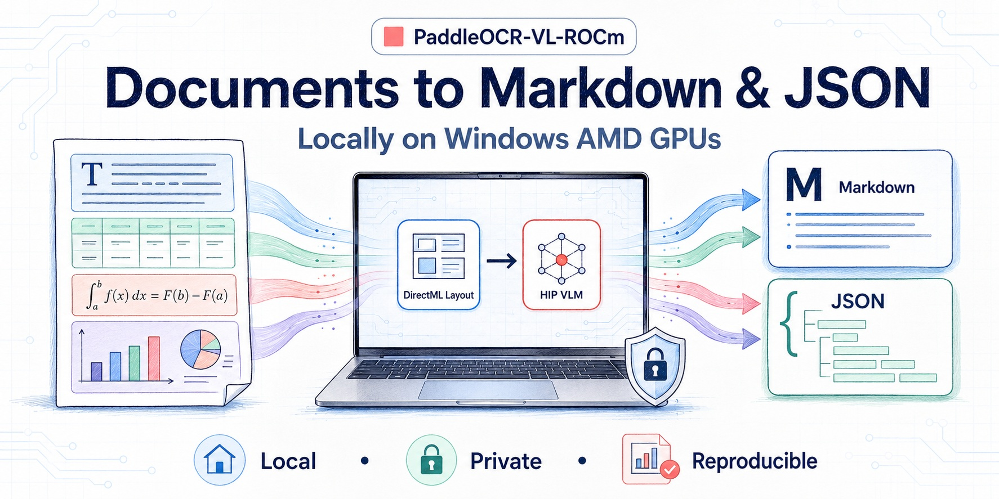
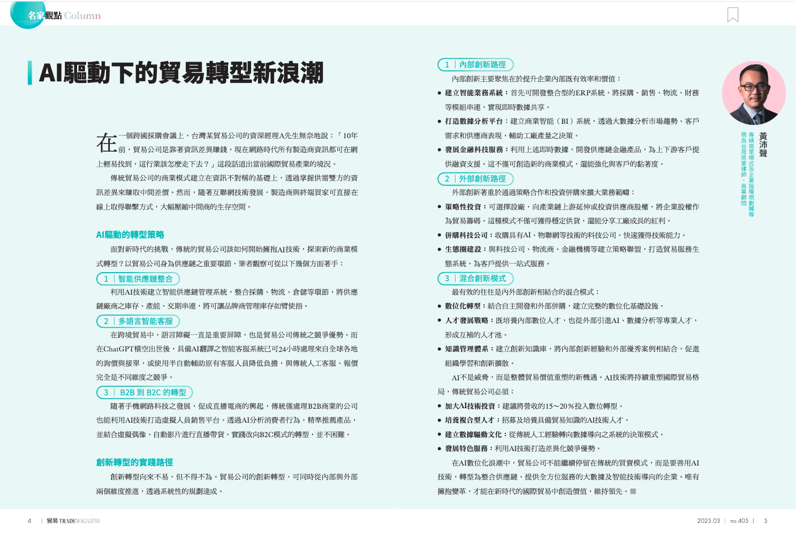

# PaddleOCR-VL-ROCm



Run PaddleOCR-VL 1.6 locally on Windows AMD GPUs and convert document images
into Markdown and structured JSON.

This project uses a hybrid backend; the whole pipeline does **not** run through
ROCm:

```text
Image
→ PP-DocLayoutV3 / ONNX Runtime DirectML
→ Region crops
→ PaddleOCR-VL / llama.cpp HIP
→ Markdown + JSON
```

[中文文档](README.zh-CN.md)

> Release status: **v0.1.0 is BLOCKED**, but **G3 accuracy is PASS** at
> **Overall 95.99**. PaddleOCR confirmed the result out of band, and the project
> maintainer accepted it without another full run on 2026-07-17. **G4 is PASS**
> at mean 6.33 seconds/page and P95 19.54; G5 remains blocked. See the
> [G3 maintainer attestation](docs/releases/0.1.0-g3-attestation.md) and
> [OmniDocBench v1.6 fact sheet](docs/benchmarks/omnidocbench-v1.6.md).

| Metric | PaddleOCR-VL (paper) | PaddleOCR-VL-ROCm (accepted) |
|---:|---:|---:|
| Overall | 96.33 | **95.99** |
| Text Edit-dist | 0.033 | 0.03488 |
| Reading-order Edit-dist | 0.127 | 0.12882 |
| Table TEDS | 94.76 | **94.09** |
| Formula CDM | 97.49 | **97.36** |

## Input and output

The repository includes a real compatibility fixture:



- Input: [`examples/input/magazine.png`](examples/input/magazine.png)
- Golden Markdown: [`tests/fixtures/golden/magazine.md`](tests/fixtures/golden/magazine.md)
- Golden structured JSON: [`tests/fixtures/golden/magazine.json`](tests/fixtures/golden/magazine.json)

This is a compatibility demo, not release evidence. It shows the public output
shape but does not establish current hardware speed or G4 acceptance.

## Why this project

PaddleOCR-VL normally depends on a VLM serving stack that is awkward to deploy
on Windows AMD systems. This package joins:

- DirectML document-layout inference;
- a pinned Windows llama.cpp HIP runtime and verified GGUF resources;
- an external OpenAI-compatible endpoint option;
- stable CLI and Python output contracts;
- auditable OmniDocBench tooling.

## Verified scope

- One Windows 11 / Radeon 8060S machine passed verified-cache setup, DirectML
  layout activation, managed-server smoke inference, and existing-server smoke
  inference.
- The exact AMD driver and HIP runtime versions were not captured, so this is
  not a reproducible performance or release-gate benchmark.
- The managed download manifest pins 2.27 GB (2.12 GiB) of resources by size
  and SHA-256.
- The formal scoring denominator is 1,651 GT pages. The approved official-local
  run has 1,650 successful predictions and one failed page scored as an empty
  prediction; it is **not** a 1,650-page score with a symmetric exclusion.

See the [compatibility matrix](docs/compatibility/windows-amd.md) and
[benchmark fact sheet](docs/benchmarks/omnidocbench-v1.6.md) for evidence and
limitations.

## Five-minute Quick Start

Recommended: Windows 11, Python 3.11, PowerShell, an AMD GPU supported by the
current AMD HIP SDK, and at least 5 GiB free disk space.

```powershell
git clone https://github.com/AIwork4me/PaddleOCR-VL-ROCm.git
cd PaddleOCR-VL-ROCm

py -3.11 -m venv .venv
.venv\Scripts\Activate.ps1

python -m pip install --upgrade pip
pip install -e ".[download]"

paddleocr-vl-rocm setup --auto
paddleocr-vl-rocm doctor
paddleocr-vl-rocm run examples/input/magazine.png
```

`setup --auto` downloads, verifies, installs, and starts the managed server on
port 8111. The default root is
`%LOCALAPPDATA%\PaddleOCR-VL-ROCm`; models are under `models\`, the runtime is
under `runtime\`, cached downloads are under `cache\`, and `config.json`
records the active paths.

Use a different drive or directory with:

```powershell
paddleocr-vl-rocm setup --auto --root D:\PaddleOCR-VL-ROCm
```

Use `setup --no-start` to install without starting the server. The CLI prints
the exact `llama-server.exe` command needed to start it later.

The project currently has no managed `stop` or `clean` command. Stop the
`llama-server.exe` process you started before removing the managed root. Do not
delete a shared `--root` until you have checked its contents.

## Existing server

To keep your own llama.cpp, vLLM, or other OpenAI-compatible endpoint:

```powershell
pip install -e ".[download]"
paddleocr-vl-rocm doctor --server-url http://127.0.0.1:8111/v1
paddleocr-vl-rocm run examples/input/magazine.png --server-url http://127.0.0.1:8111/v1
```

The backward-compatible legacy form is also available:

```powershell
paddleocr-vl-rocm --input examples/input/magazine.png --server-url http://127.0.0.1:8111/v1
```

Use `--api-model-name` when the endpoint requires a specific model identifier.
The external server owns its GPU/runtime compatibility; this repository does
not validate or install that server.

## CLI

```text
paddleocr-vl-rocm setup [--auto | --no-start] [--root PATH] [--force]
paddleocr-vl-rocm doctor [--json] [--config PATH] [--server-url URL]
paddleocr-vl-rocm run INPUT [--output DIR] [--layout-model DIR]
                         [--layout-provider auto|directml|cpu]
                         [--server-url URL] [--api-model-name NAME]
                         [--vlm-max-workers N]
```

The public concurrency default is `vlm_max_workers=8` for the CLI, Python API,
and low-level parser. Override it only when memory pressure or the server's
request capacity requires a lower value.

English users can obtain PP-DocLayoutV3 ONNX from
[Hugging Face](https://huggingface.co/PaddlePaddle/PP-DocLayoutV3_onnx).
Chinese users can use the
[ModelScope mirror](https://modelscope.cn/models/PaddlePaddle/PP-DocLayoutV3_onnx).
Managed setup downloads the pinned model automatically.

## Python API

```python
from paddleocr_vl_rocm import PaddleOCRVLROCm

pipeline = PaddleOCRVLROCm(
    layout_model_dir="models/PP-DocLayoutV3-onnx",
    vlm_server_url="http://127.0.0.1:8111/v1",
)
result = pipeline.predict("examples/input/magazine.png")
print(result.markdown_text)
```

## Output structure

The CLI writes `result.md` and `result.json` under `--output` (default:
`outputs`). JSON contains the source path, page dimensions, ordered blocks,
labels, bounding boxes, recognition content, and provider metadata. Treat
coordinates and labels as a versioned compatibility contract; compare against
the tracked golden fixtures when changing layout or serialization.

## Reproduce evaluation

Read [`eval/README.md`](eval/README.md) before downloading data or running a
score. It pins the OmniDocBench checkout, documents inference/scoring stages,
and rejects incomplete release artifacts. Public numbers and gate status live
only in the
[OmniDocBench v1.6 fact sheet](docs/benchmarks/omnidocbench-v1.6.md).

Do not publish results from a subset, mismatched scorer, fallback output, or
unverified artifact.

## Troubleshooting

- **PowerShell blocks activation:** use
  `Set-ExecutionPolicy -Scope Process Bypass`, then activate the venv again.
- **Port 8111 is busy:** stop the intended process or use an external server on
  another port and pass `--server-url`.
- **Downloads fail:** rerun setup; partial downloads are resumable. Proxy, DNS,
  and GitHub release-asset access must work.
- **DirectML is unavailable:** update the AMD graphics driver, then run
  `paddleocr-vl-rocm doctor --json`. Managed Windows validation requires
  DirectML first and disables silent CPU fallback.
- **HIP DLL or server startup fails:** compare the GPU and OS with AMD's current
  Windows HIP support table, then inspect
  `%LOCALAPPDATA%\PaddleOCR-VL-ROCm\logs\server.log`.
- **Sensitive diagnostics:** redact user names, local paths, tokens, private
  documents, and endpoint credentials before posting Doctor JSON or logs.

## Known limitations

- v0.1.0 is not release-ready; G5 is blocked. G3 and G4 are PASS.
- Only one Windows AMD machine has project-recorded smoke validation.
- G4 passes latency and a targeted GT accuracy projection. Raw historical
  output equivalence remains false on 8/27 frozen pages and is not claimed. See the
  [G4 diagnostic](docs/releases/0.1.0-g4-diagnostic.md).
- Managed setup is Windows-only and has no stop/cleanup command.
- Empty-cache public-network setup has not completed the release acceptance
  path; verified-cache installation has.

## Roadmap

See [`ROADMAP.md`](ROADMAP.md). Near-term priorities are reproducible hardware
reports and complete clean-network onboarding.

## Contributing, security, and license

Read [`CONTRIBUTING.md`](CONTRIBUTING.md), use the appropriate
[issue form](.github/ISSUE_TEMPLATE), and report vulnerabilities privately as
described in [`SECURITY.md`](SECURITY.md). Licensed under the
[MIT License](LICENSE).
